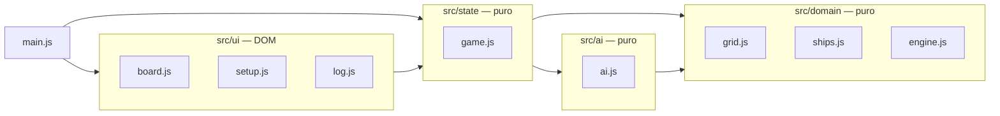
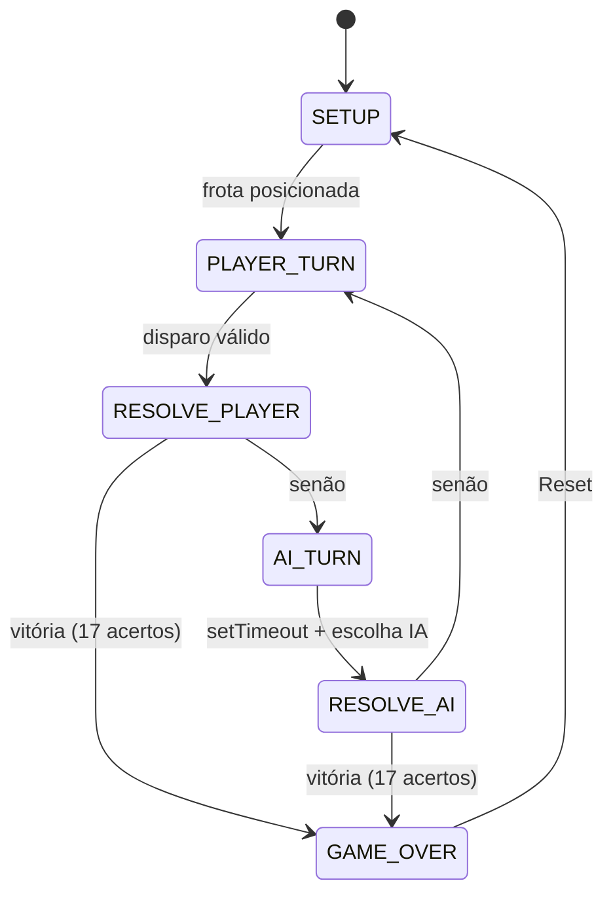

# design.md — Design técnico

Design proporcional ao tamanho do projeto. Registra como a solução satisfaz os
requisitos e quais restrições não podem ser violadas.

## 1. Arquitetura de módulos



- `domain/grid.js`: `ShipGrid` — recebe disparos e consulta estado de células.
- `domain/ships.js`: definições da frota, validação de posicionamento e gerador
  aleatório com backtracking.
- `domain/engine.js`: resolução de disparo, detecção de naufrágio e vitória.
- `ai/ai.js`: classe `AI` com máscara, pilha de caça e escolha de alvo.
- `state/game.js`: máquina de estados e lock de turno.
- `ui/*`: renderização CSS Grid, event delegation, setup e log.
- `main.js`: composição (bootstrap).

## 2. Modelo de dados

```text
Coord      = { row: 0..9, col: 0..9 }
Cell       = { shipId: string | null, hit: boolean }
Ship       = { id, name, size, cells: Coord[], hits: number }
ShipGrid   = { cells: Cell[100], ships: Map<id, Ship> }
AIMask     = { hits: Set<coordKey>, misses: Set<coordKey>, sunk: Set<shipId> }
HuntStack  = Coord[]   // LIFO (push no topo, pop do topo)
```

`coordKey = `${row}:${col}`` como chave de `Set`/`Map`.

## 3. Máquina de estados



**Lock de turno**: enquanto o estado for `AI_TURN`, cliques no tabuleiro de
ataque são ignorados. O disparo da IA é agendado com `setTimeout(..., ≤ 800ms)`
e a resolução atualiza o estado. Não há estado compartilhado concorrente além
desse lock — o modelo é single-threaded (event loop).

## 4. Algoritmo da IA

**Modo Busca (paridade)**: lista pré-computada de todas as coordenadas com
`(row + col) % 2 === 0`, embaralhada no início; itera e descarta alvos já
atacados. Garante cobrir toda célula de qualquer navio com metade dos disparos
(qualquer navio ≥ 2 toca pelo menos uma célula de paridade par).

**Modo Caça (stack)**: ao registrar um acerto, empilha as 4 adjacências válidas
(N, S, L, O) que ainda não foram atacadas. `chooseTarget` faz `pop` da pilha.
Enquanto houver acertos pendentes, permanece em caça.

**Transição**: ao confirmar naufrágio, remove as coordenadas do navio dos
"hits pendentes" e **esvazia a pilha**, retornando ao Modo Busca.

A IA recebe somente a `AIMask` — nunca o `ShipGrid` do jogador (FR-011/AC-003).

## 5. Decisões (ADRs inline)

- **ADR-001 — Vanilla**: HTML5/CSS3/JS ES6+ puros. Contexto: portabilidade e
  ausência de build. Consequência: mais código de UI manual, porém sem cadeia de
  dependências.
- **ADR-002 — `setTimeout` para a IA**: Contexto: latência de "pensamento" ≤ 800
  ms. Consequência: implementação trivial e testável; Web Worker rejeitado por
  complexidade desnecessária.
- **ADR-003 — ES Modules**: Contexto: testabilidade com `node --test`.
  Consequência: exige servir via HTTP (não funciona com `file://` em alguns
  navegadores) — documentado no README.
- **ADR-004 — Clique + rotação**: Contexto: mobile-first e menor complexidade.
  Consequência: drag-and-drop rejeitado.
- **ADR-005 — `node --test`**: Contexto: zero dependências. Consequência: testes
  limitados ao Node; UI coberta por teste manual.

## 6. Tratamento de erro e validação

- Posicionamento inválido → mensagem no log, sem aplicar.
- Disparo inválido (repetido/fora) → ignorado (sem troca de turno).
- Gerador aleatório com limite de tentativas; se falhar, regenera do zero.
- Reset limpa: grids, máscara da IA, pilha, estado, log e painéis.

## 7. Observabilidade

- Painel de log narrativo (FR-016) é a principal saída observável.
- Console (`console.debug`) para rastrear estado durante desenvolvimento.

## 8. Alternativas rejeitadas

- Web Worker (complexidade sem ganho real em grid 10×10).
- Drag-and-drop (custo mobile alto; clique+rotação cobre o requisito).
- Framework/biblioteca (fere NFR-006).
