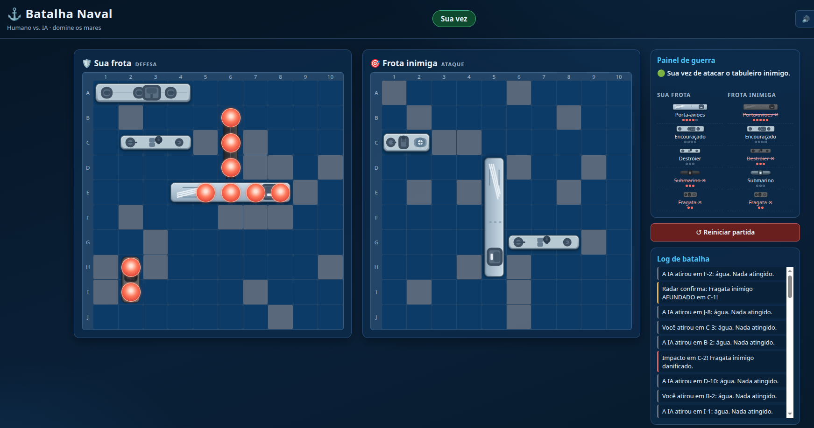
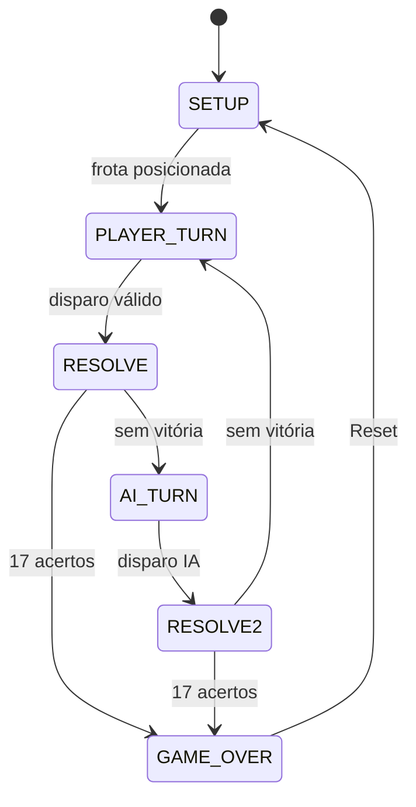

# Batalha Naval Web (Humano vs. IA)

Implementação de alta fidelidade do jogo Batalha Naval em **HTML5, CSS3 e
JavaScript (ES6+)** puro, sem nenhuma dependência de runtime. O jogador humano
enfrenta uma IA que alterna entre **Modo Busca** (paridade de tabuleiro de
xadrez) e **Modo Caça** (pilha LIFO), simulando estratégia humana sem acesso ao
tabuleiro privado do jogador.

## Captura de tela



## Objetivo

Derrotar a frota inimiga primeiro: são **17 acertos** para afundar as 5
embarcações adversárias (Porta-aviões 5, Encouraçado 4, Destróier 3, Submarino 3,
Fragata 2).

## Tecnologias

- HTML5 semântico
- CSS3 — CSS Grid, unidades `vw`/`vh`, Media Queries
- JavaScript ES6+ em **ES Modules**
- Testes unitários com o runner nativo do Node.js (`node --test`)
- **Zero** frameworks/bibliotecas de terceiros

## Como executar

O jogo é 100% estático. Basta abrir `index.html` no navegador, ou servir via HTTP:

```bash
python3 -m http.server 8000
# acesse http://localhost:8000
```

Para subir/derrubar o servidor em segundo plano com um comando:

```bash
./start.sh            # inicia o servidor em http://localhost:8000
./stop.sh             # encerra o servidor
PORT=8080 ./start.sh  # porta personalizada
```

## Como testar

```bash
node --test
```

Requisito: Node.js ≥ 20 (validado com v22.23.2).

## Estrutura de diretórios

```text
game-batalha-naval/
├── index.html              # entrada da aplicação
├── styles/
│   └── main.css            # layout, grid, responsividade
├── assets/
│   └── ships/              # arte SVG das embarcações (5 classes)
├── src/
│   ├── domain/             # motor puro (sem DOM): regras e modelo
│   │   ├── constants.js    # GRID_SIZE e orientações
│   │   ├── grid.js         # ShipGrid: células, posicionamento, disparos
│   │   ├── ships.js        # frota, geometria e gerador aleatório
│   │   └── engine.js       # acertos, naufrágio e vitória
│   ├── ai/
│   │   └── ai.js           # busca por paridade + caça stack-based (máscara)
│   ├── state/
│   │   └── game.js         # máquina de estados e controle de turnos
│   ├── ui/                 # única camada que toca DOM
│   │   ├── board.js        # renderização CSS Grid + event delegation
│   │   ├── setup.js        # posicionamento da frota (clique + rotação)
│   │   ├── log.js          # log, mensagens e silhuetas da frota
│   │   └── format.js       # conversão coordenada → rótulo (A-1…J-10)
│   └── main.js             # bootstrap
├── test/
│   ├── ships.test.js
│   ├── grid.test.js
│   ├── engine.test.js
│   ├── ai.test.js
│   └── game.test.js
├── docs/
│   └── descricao.txt       # especificação de requisitos original
├── .specs/                 # artefatos do SDD
├── SPECIFICATION.md        # especificação estruturada (FR/NFR/AC)
├── TASKS.md                # estado das tarefas
├── AGENTS.md               # regras permanentes do projeto
├── STATUS.md               # estado atual do desenvolvimento
├── HANDOFF.md              # continuidade entre agentes
├── LICENSE                 # Apache License 2.0
└── README.md
```

## Regras do jogo (resumo)

- Tabuleiro 10×10; linhas **A–J**, colunas **1–10**.
- Posicionamento por **clique + rotação** (horizontal/vertical), sem sobreposição
  ou extrapolamento de bordas; gerador aleatório disponível.
- Turnos sequenciais, **humano inicia**; alternância obrigatória após disparo
  válido.
- Disparo em célula já atacada ou fora do grid é inválido (bloqueado).
- Vitória declarada exatamente após o **17º acerto**.
- **Reset Game** reinicia matrizes e logs sem recarregar a página.

## Feedback visual e sonoro

- Embarcações desenhadas como arte SVG contínua sobre as células (rotacionadas
  quando verticais); naufrágios revelam a silhueta no tabuleiro inimigo.
- Acertos exibem marcadores vermelhos de dano e as silhuetas do painel apagam
  quando a embarcação afunda.
- Sons sintetizados via **Web Audio API** (sem arquivos): `splash` quando cai na
  água, `impacto` ao atingir um navio e `explosão` ao afundá-lo. Há controles de
  som no topo: botão **mudo/ativar** (🔊/🔇) e **volume**. O áudio é desbloqueado
  no primeiro clique (autoplay) e, ao reativar o som, um tom de teste confirma
  que está funcionando.

## Fluxo geral



## Licença

Apache License 2.0 — veja o arquivo `LICENSE`.

Copyright 2026 William
